# Predictive Maintenance — ML Working, Workflow & DFD

---

## 1. How the ML Model Works (Simplified)

### 1.1 The Goal

> Given the last 50 sensor readings from a machine, **predict whether it will fail soon**.

The model answers one question: **What is the risk level?**

| Output | Meaning |
|--------|---------|
| **LOW (0)** | Machine is healthy, no action needed |
| **MEDIUM (1)** | Showing early signs of wear, schedule maintenance |
| **HIGH (2)** | Failure is likely, immediate attention required |

### 1.2 What is a RandomForest?

Think of it as **150 experts** voting on the machine's condition:

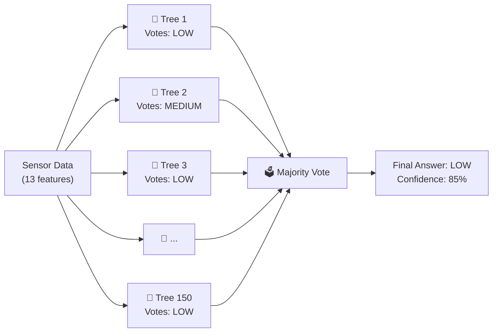

**Each tree** is a Decision Tree — a flowchart of yes/no questions:

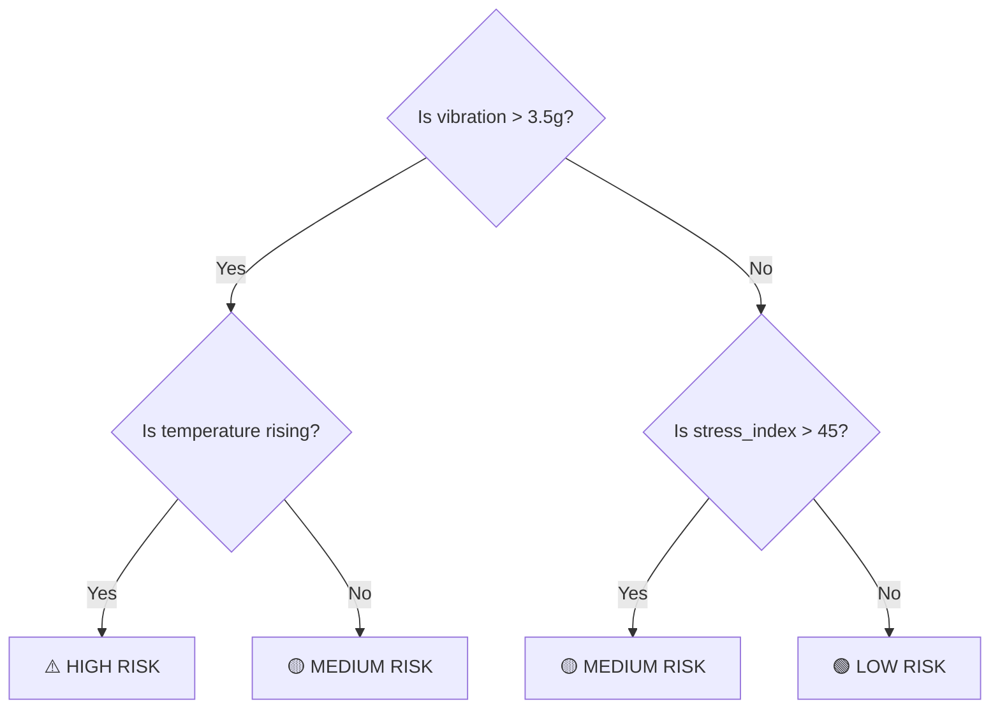

**Why 150 trees?** One tree can make mistakes, but when 150 trees vote together, the errors cancel out — like asking 150 doctors instead of 1.

### 1.3 What Goes INTO the Model (Features)

Raw sensor data is **too noisy** to use directly. We engineer 13 meaningful features:

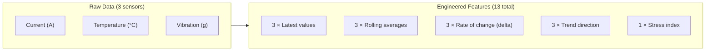

**Example**: For a machine with these last 10 vibration readings:
`[1.2, 1.3, 1.5, 1.8, 2.1, 2.5, 2.9, 3.2, 3.6, 4.0]`

| Feature | Value | What It Tells Us |
|---------|-------|------------------|
| `vibration` (latest) | 4.0g | Current state — elevated |
| `vibration_rolling_avg` | 2.61g | Average over 10 readings |
| `vibration_delta` | +0.4g | Last reading jumped by 0.4 |
| `vibration_trend` | RISING (+1) | Consistently increasing |
| [stress_index](file:///f:/Predictionmodel/analytics.py#155-209) | 62 | Overall machine strain is high |

### 1.4 How the Model Learns (Training)

Since we can't manually label thousands of readings as "healthy" or "failing", we use **Weak Supervision** — automated rules that act like a teacher:

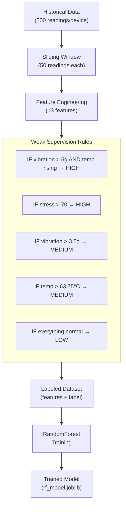

**Why weak supervision?** In a factory, you can't stop machines and manually tag every reading as "about to fail". Instead, we define rules from domain knowledge (e.g., "vibration above 5g with rising temperature is dangerous") and let the algorithm learn the subtler patterns.

### 1.5 What Comes OUT (Predictions)

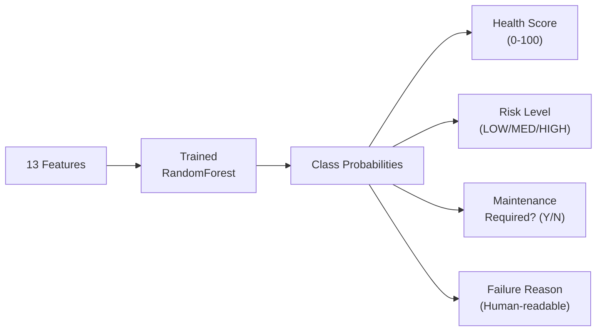

**Health Score formula**:
```
Health = P(LOW) × 100 + P(MEDIUM) × 50 + P(HIGH) × 0
```

| Model Output | P(LOW) | P(MED) | P(HIGH) | Health | Risk | Maintenance? |
|-------------|--------|--------|---------|--------|------|-------------|
| Healthy | 0.92 | 0.06 | 0.02 | 95 | LOW | No |
| Degrading | 0.25 | 0.60 | 0.15 | 55 | MEDIUM | Yes |
| Failing | 0.03 | 0.12 | 0.85 | 9 | HIGH | Yes |

---

## 2. Complete System Workflow

### 2.1 End-to-End Workflow Diagram

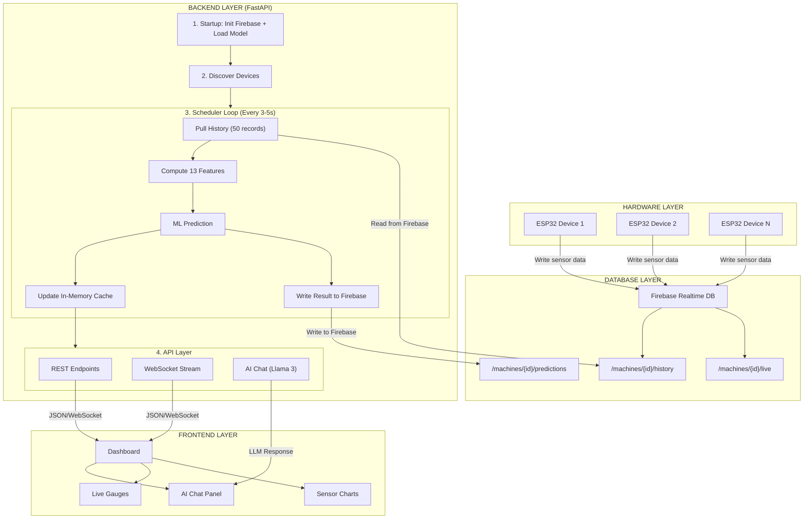

### 2.2 Training Workflow

```mermaid
graph LR
    A["1. Run train_model.py"] --> B["2. Connect to Firebase"]
    B --> C["3. Pull all device history"]
    C --> D["4. Sliding window<br/>(size=50, step=5)"]
    D --> E["5. Build 13 features<br/>per window"]
    E --> F["6. Auto-label using<br/>weak supervision rules"]
    F --> G["7. Train RandomForest<br/>(150 trees, depth=12)"]
    G --> H["8. Cross-validate"]
    H --> I["9. Save model to<br/>models/rf_model.joblib"]
```

### 2.3 Inference Workflow (Real-Time)

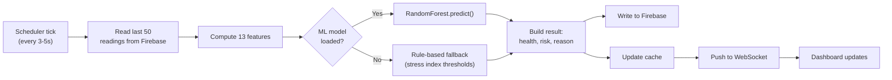

---

## 3. Data Flow Diagrams (DFD)

### 3.1 Context Diagram (Level 0)

Shows the entire system as a single process with external entities:

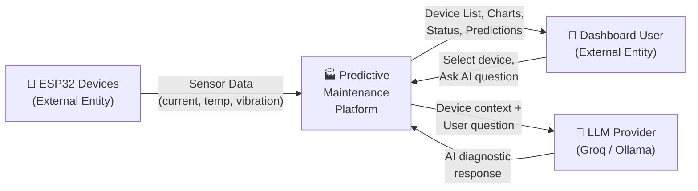

### 3.2 Level 1 DFD — Major Processes

```mermaid
graph TD
    ESP["🔧 ESP32"] -->|Raw sensor data| DS1[("Firebase<br/>RTDB")]
    
    DS1 -->|Device IDs| P1["P1: Device<br/>Discovery"]
    P1 -->|Registered devices| DS2[("Device<br/>Registry")]
    
    DS1 -->|History (50 records)| P2["P2: Feature<br/>Engineering"]
    P2 -->|13 features| P3["P3: ML<br/>Prediction"]
    
    P3 -->|Prediction result| DS1
    P3 -->|Cached prediction| DS3[("Prediction<br/>Cache")]
    
    DS3 -->|Latest prediction| P4["P4: API<br/>Server"]
    DS2 -->|Device info| P4
    DS1 -->|Chart data| P4
    
    P4 -->|"JSON / WebSocket"| USER["👤 User"]
    
    USER -->|"Chat message"| P5["P5: Context<br/>Builder"]
    DS2 -->|Device data| P5
    DS3 -->|Prediction| P5
    P5 -->|Grounded context| P6["P6: Chat<br/>Engine"]
    P6 -->|Prompt| LLM["🤖 LLM"]
    LLM -->|Response| P6
    P6 -->|AI answer| P4
```

### 3.3 Level 2 DFD — ML Prediction Process (P3 expanded)

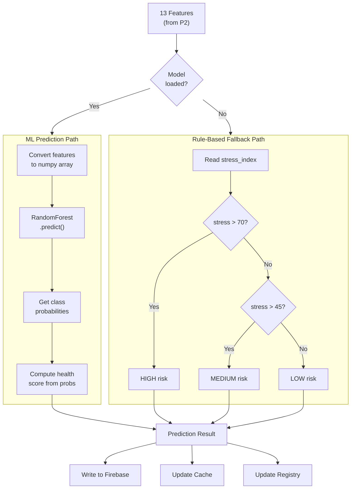

### 3.4 Level 2 DFD — Feature Engineering Process (P2 expanded)

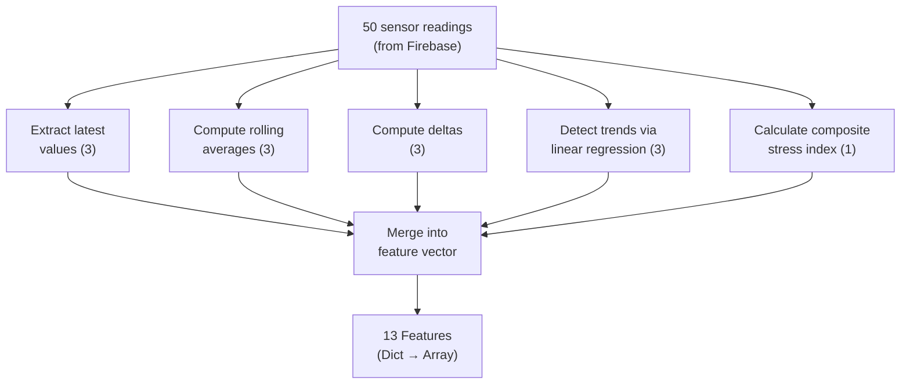

---

## 4. ML Pipeline Summary Table

| Stage | Input | Process | Output |
|-------|-------|---------|--------|
| **Data Collection** | Firebase RTDB | Pull 500 records per device | Raw time-series data |
| **Windowing** | Raw data | Sliding window (size=50, step=5) | Multiple overlapping samples |
| **Feature Engineering** | 50 raw readings | Rolling avg, delta, trend, stress | 13 numeric features |
| **Labeling** | 13 features | Threshold rules (weak supervision) | Label: 0, 1, or 2 |
| **Training** | Features + Labels | RandomForest (150 trees, depth=12) | Trained classifier |
| **Validation** | Training data | k-fold cross-validation | Accuracy score |
| **Serialization** | Trained model | `joblib.dump()` | `rf_model.joblib` file |
| **Loading** | `.joblib` file | `joblib.load()` at startup | In-memory model |
| **Inference** | 13 live features | `model.predict()` + `predict_proba()` | Risk + Health Score |
| **Fallback** | Stress index | Threshold comparison | Risk + Health Score |

---

## 5. Key ML Concepts Used

| Concept | How We Use It |
|---------|--------------|
| **Supervised Learning** | Model learns from labeled examples (features → risk class) |
| **Ensemble Methods** | 150 trees vote together → more accurate than 1 tree |
| **Bagging** | Each tree trained on a random subset of data → reduces overfitting |
| **Feature Importance** | RandomForest tells us which sensors matter most |
| **Class Imbalance Handling** | `class_weight="balanced"` gives rare classes (HIGH risk) more weight |
| **Cross-Validation** | Test model on unseen splits to estimate real-world accuracy |
| **Weak Supervision** | Auto-generate labels from domain rules instead of manual tagging |
| **Graceful Degradation** | If ML model missing → fall back to rule-based heuristics |

---

