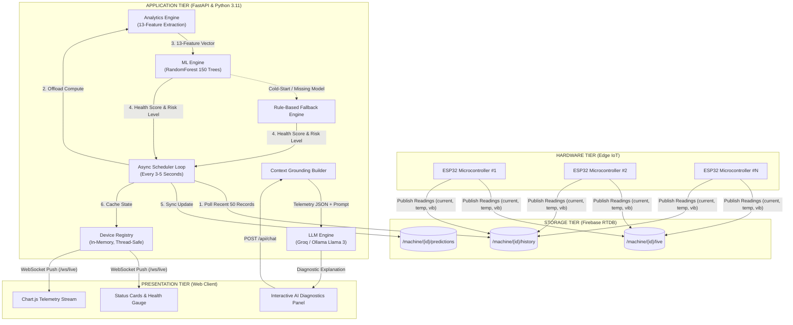
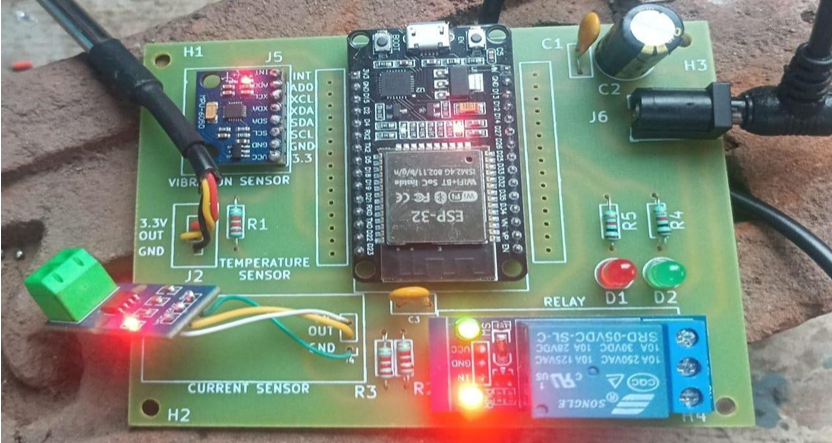

# ⚙️ PredictiveMaintAI — Real-Time IoT Predictive Maintenance & Explainable AI


An end-to-end, commercial-grade **Predictive Maintenance and Diagnostics Platform** designed for industrial machinery and IoT sensor arrays. The platform ingests telemetry data from **ESP32 microcontrollers**, extracts **13 real-time engineered features**, forecasts impending equipment failures using an ensemble **RandomForest ML classifier**, streams live predictions via **WebSockets**, and offers **data-grounded conversational diagnostics** powered by **Llama 3**.

---

## 📸 Screenshots

A visual walkthrough of the real-time Predictive Maintenance web platform and conversational diagnostic interface:

### 1. Live Telemetry & Machine Health Overview (`Dashboard 1`)
Real-time operational dashboard monitoring edge device `device_002` with high-frequency telemetry, ML-derived health score, and risk assessment:


- **KPI Status Cards**:
  - **Health Score (`57.2`)**: Continuously calculated using class probability distribution from the Random Forest model.
  - **Risk Level (`MEDIUM`)**: Identifies early degradation stage before severe mechanical breakdown.
  - **Maintenance Flag (`REQUIRED`)**: Automated alert triggered when risk exceeds normal operational thresholds.
  - **Stress Index (`58.93 / 100`)**: Multi-sensor composite score combining vibration stress (40%), thermal stress (35%), current anomalies (25%), and trend penalties.
- **Sensor Telemetry Stream**: Interactive Chart.js graph plotting Current ($A$), Temperature ($^\circ\text{C}$), and Vibration ($g$) with toggleable time intervals (`30s`, `1m`, `5m`).
- **Health & Predictions Graph**: Historical trajectory tracking machine degradation curves over time.
- **Live Sensor Gauges & Trends**: Real-time channel readouts with linear regression trend arrows: Current (`0.21 A ↑ RISING`), Temperature (`35.3 °C ↑ RISING`), Vibration (`0.08 g ↓ FALLING`).
- **Failure Reason Banner**: Plain-English diagnosis indicating that *"Multiple parameters trending toward abnormal thresholds."*

---

### 2. Conversational AI Diagnostics Assistant (`Dashboard 2`)
Explainable AI interface powered by Llama 3 that allows plant operators and engineers to query equipment state and receive data-grounded insights:


- **Interactive AI Dialogue**: Grounded conversational assistant that receives real-time JSON context (sensor readings, trend vectors, threshold margins) to eliminate hallucinations.
- **One-Click Quick Actions**:
  - 🔍 **"Why maintenance?"**: Queries the specific telemetry channels exceeding tolerances.
  - 🛡️ **"Is it safe?"**: Evaluates immediate risk of catastrophic hardware failure.
  - ⚙️ **"What's wrong?"**: Breaks down abnormal sensor trends and load conditions.
  - 📋 **"Actions needed?"**: Suggests actionable mitigation and maintenance protocols.
- **Dual LLM Provider Flexibility**: Seamlessly switches between local on-device inference via **Ollama (Llama 3.2)** and high-speed cloud inference via **Groq (Llama 3.3-70B)**.

---

## 🌟 Key Features

- **⚡ Real-Time IoT Ingestion**: Direct integration with Firebase Realtime Database collecting current ($A$), surface temperature ($^\circ\text{C}$), and vibration ($g$) from distributed ESP32 microcontrollers.
- **🔬 13-Dimensional Feature Pipeline**: Converts raw, noisy sensor channels into high-signal indicators:
  - 3 $\times$ Instantaneous sensor readings
  - 3 $\times$ Rolling averages (10-reading noise reduction)
  - 3 $\times$ First-order delta values (rate of change)
  - 3 $\times$ Linear regression trend slopes (encoded direction: $\text{Rising} (+1)$, $\text{Stable} (0)$, $\text{Falling} (-1)$)
  - 1 $\times$ Multi-sensor composite stress index ($0-100$)
- **🧠 Probabilistic Machine Learning Model**:
  - 150-estimator `RandomForestClassifier` with balanced class weights.
  - Generates continuous **Health Scores** ($0–100$) derived from class probability distributions.
  - Multi-tiered risk classification: `LOW` (Healthy), `MEDIUM` (Degrading / Wear), `HIGH` (Critical / Imminent Failure).
- **🛡️ Resilient Rule-Based Fallback**: Built-in deterministic stress heuristics ensure uninterrupted monitoring even before initial model training or in cold-start states.
- **💬 Data-Grounded Conversational AI**:
  - Leverages **Llama 3.3-70B** (via Groq API) or **Llama 3.2** (via local Ollama).
  - Uses dynamic context injection with device telemetry, trend vectors, and operational thresholds—preventing AI hallucinations.
  - Quick-action diagnostics: *"Why maintenance?"*, *"Is machine safe?"*, *"What's wrong?"*, *"Actions needed?"*.
- **📊 Real-Time WebSocket Streaming**: Bi-directional asynchronous updates deliver 4-second refresh cycles straight to Chart.js visualizers.
- **🎨 Sleek Industrial Dark UI**: Modern dark-mode interface built with Vanilla CSS and responsive grid layouts.

---

## 🏗️ System Architecture



---

## 🔬 Feature Engineering Matrix

Raw IoT sensors produce volatile signals. The `analytics.py` pipeline cleans and translates them into 13 high-dimensional features:

| # | Feature Name | Computation / Formula | Engineering Purpose |
|:---:|:---|:---|:---|
| **1** | `current` | Latest sample $I_t$ | Instantaneous electrical current load ($A$) |
| **2** | `temperature` | Latest sample $T_t$ | Instantaneous casing/bearing temperature ($^\circ\text{C}$) |
| **3** | `vibration` | Latest sample $V_t$ | Instantaneous accelerometer amplitude ($g$) |
| **4** | `current_rolling_avg` | $\frac{1}{N}\sum_{i=0}^{N-1} I_{t-i}, (N=10)$ | Noise reduction; smoothed electrical baseline |
| **5** | `temperature_rolling_avg`| $\frac{1}{N}\sum_{i=0}^{N-1} T_{t-i}, (N=10)$ | Thermal inertia tracking |
| **6** | `vibration_rolling_avg`  | $\frac{1}{N}\sum_{i=0}^{N-1} V_{t-i}, (N=10)$ | Mechanical vibration baseline |
| **7** | `current_delta` | $I_t - I_{t-1}$ | Instant rate of electrical load change |
| **8** | `temperature_delta` | $T_t - T_{t-1}$ | Thermal divergence rate |
| **9** | `vibration_delta` | $V_t - V_{t-1}$ | Mechanical shock and acceleration jump |
| **10**| `current_trend_encoded` | $\text{Slope of Linear Regression over last 5 readings}$ | Directional trend: $+1$ (Rising), $0$ (Stable), $-1$ (Falling) |
| **11**| `temperature_trend_encoded`| $\text{Slope of Linear Regression over last 5 readings}$ | Thermal trajectory: $+1$ (Heating), $0$ (Constant), $-1$ (Cooling) |
| **12**| `vibration_trend_encoded`  | $\text{Slope of Linear Regression over last 5 readings}$ | Wear trajectory: $+1$ (Escalating), $0$ (Steady), $-1$ (Dampening) |
| **13**| `stress_index` | $0.40 \cdot \text{VibStress} + 0.35 \cdot \text{TempStress} + 0.25 \cdot \text{CurrAnomaly} + \text{TrendMod}$ | Composite multi-sensor machine stress score ($0-100$) |

### Health Score Formula
The continuous machine health score is computed directly from model class probability outputs:

$$\text{Health Score} = P(\text{LOW}) \times 100 + P(\text{MEDIUM}) \times 50 + P(\text{HIGH}) \times 0$$

| Risk Level | Health Range | Condition | Action Required |
|:---|:---:|:---|:---|
| 🟢 **LOW (0)** | $75 - 100$ | Normal operating parameters | Nominal. No action required. |
| 🟡 **MEDIUM (1)**| $40 - 74$ | Early signs of mechanical/electrical wear | Schedule preventive inspection during next shift. |
| 🔴 **HIGH (2)** | $0 - 39$ | Critical anomaly or imminent bearing failure | Immediate maintenance required. Inspect equipment. |

---

## 📡 REST API & WebSocket Specifications

| Method | Endpoint | Description | Sample Output / Payload |
|:---:|:---|:---|:---|
| `GET` | `/api/devices` | List all discovered edge devices and connection health | `{"devices": [{"device_id": "device_002", "has_live_data": true, "health_score": 57.2}], "count": 1}` |
| `GET` | `/api/chart-data` | Retrieve historical sensor telemetry and health scores (`?device_id=device_002&seconds=60`) | `{"device_id": "device_002", "sensor_data": [...], "predictions": [...]}` |
| `GET` | `/api/status` | Instantaneous device snapshot, live telemetry, and ML inference | `{"device_id": "device_002", "prediction": {"health_score": 57.2, "risk_level": "MEDIUM"}}` |
| `POST`| `/api/chat` | Data-grounded conversational diagnostic query | Request: `{"device_id": "device_002", "message": "Why is maintenance required?"}` |
| `WS`  | `/ws/live` | Persistent duplex streaming of telemetry, predictions, and gauges | `{"prediction": {...}, "live_data": {"current": 0.21, "temperature": 35.3, "vibration": 0.08}}` |

---

## 🗂️ Project Structure

```bash
Predictivemodel/
├── analytics.py             # 13-feature engineering pipeline, trend regression, stress index
├── chat_engine.py           # Conversational AI interface (Groq API & Ollama fallback)
├── config.py                # Centralized configuration & environment variable loaders
├── context_builder.py       # Sensor telemetry context assembler for LLM prompts
├── device_registry.py       # Thread-safe in-memory cache and device registry
├── firebase_client.py       # Firebase Realtime Database read/write sync operations
├── firebase_credentials.json# Service account credentials for Firebase Admin SDK
├── main.py                  # FastAPI application, lifespan management, REST & WebSocket
├── ml_engine.py             # Model inference engine with heuristic fallback logic
├── ml_report.html           # Comprehensive technical report with Mermaid diagrams
├── ML_Working_Explained.md  # Detailed technical notes on Random Forest & Weak Supervision
├── requirements.txt         # Project dependencies
├── scheduler.py             # Background async loop polling telemetry & executing inference
├── train_model.py           # Offline training script using weak supervision & sliding windows
├── screenshots/             # Production UI and Hardware Module screenshots
│   ├── Dashboard 1.png      # Telemetry charts, health score, and risk indicators
│   ├── Dashboard 2.png      # Conversational AI diagnostics panel & gauges
│   └── Hardware PCB Module.png # Custom ESP32 sensor rig and relay circuitry
├── models/
│   └── rf_model.joblib      # Serialized 150-tree RandomForest trained weights
└── static/
    ├── app.js               # Frontend controller, Chart.js managers, WebSocket client
    ├── index.html           # Industrial dark-theme monitoring dashboard
    └── style.css            # Custom responsive styles, glassmorphic cards, badges
```

---

## 🚀 Getting Started

### 1. Prerequisites
- **Python 3.10** or **Python 3.11**
- A **Firebase Realtime Database** project
- *(Optional)* [Ollama](https://ollama.ai/) running locally for free on-device AI diagnostics (`ollama run llama3.2:1b`), or a [Groq API Key](https://console.groq.com/) for cloud inference.

### 2. Installation

1. **Clone the repository**:
   ```bash
   git clone https://github.com/your-username/PredictiveMaintAI.git
   cd PredictiveMaintAI
   ```

2. **Create and activate a virtual environment**:
   ```bash
   # Linux / macOS
   python3 -m venv venv
   source venv/bin/activate

   # Windows (PowerShell)
   python -m venv venv
   .\venv\Scripts\Activate.ps1
   ```

3. **Install dependencies**:
   ```bash
   pip install -r requirements.txt
   ```

4. **Firebase Configuration**:
   - Place your service account private key in the root directory as `firebase_credentials.json`.
   - Update `FIREBASE_DATABASE_URL` in `config.py` (or export as an environment variable):
     ```bash
     export FIREBASE_DATABASE_URL="https://your-firebase-database.firebasedatabase.app/"
     ```

### 3. Model Training *(Optional)*
The repository includes pre-trained weights in `models/rf_model.joblib`. To re-train the model on updated historical data from Firebase:
```bash
python train_model.py
```
*The training script uses sliding windows (window size: 50, step: 5), extracts the 13-feature vectors, generates weak-supervision domain labels, fits a 150-tree Random Forest, performs k-fold cross validation, and exports the serialized model.*

### 4. Run the Server
Launch the FastAPI server and background scheduler:
```bash
python main.py
```

Visit the interactive dashboard in your browser:
👉 **`http://localhost:8000`**

Interactive API documentation (Swagger UI):
👉 **`http://localhost:8000/docs`**

---

## ⚙️ Configuration Reference

Settings can be customized via environment variables or directly in `config.py`:

| Variable | Default Value | Description |
|:---|:---|:---|
| `FIREBASE_CREDENTIALS_PATH` | `firebase_credentials.json` | Path to Firebase service account JSON |
| `FIREBASE_DATABASE_URL` | *RTDB URL* | Firebase Realtime Database endpoint |
| `SCHEDULER_INTERVAL` | `4.0` | Scheduler loop cycle interval in seconds |
| `LLM_PROVIDER` | `ollama` | Diagnostic LLM provider (`groq` or `ollama`) |
| `GROQ_API_KEY` | `""` | API key for Groq Cloud inference |
| `GROQ_MODEL` | `llama-3.3-70b-versatile` | Model ID for Groq provider |
| `OLLAMA_BASE_URL` | `http://localhost:11434` | Ollama HTTP endpoint |
| `OLLAMA_MODEL` | `llama3.2:1b` | Local Ollama model tag |
| `HOST` | `0.0.0.0` | Bind host address |
| `PORT` | `8000` | Bind port number |

---

## 🛠️ IoT Hardware Integration (ESP32)

### Custom Sensor Rig & Circuitry
The edge telemetry module integrates an ESP-32 SoC with multi-sensor probing to monitor mechanical and electrical parameters:



- **Microcontroller**: ESP-32 Wi-Fi / Bluetooth IoT microcontroller.
- **Vibration Sensing**: MPU-6050 3-axis accelerometer and gyro detecting micro-vibrations and mechanical imbalances.
- **Current Sensing**: Analog current sensor measuring AC/DC motor load in amperes.
- **Temperature Probe**: Dedicated surface thermal sensor monitoring bearing and casing temperature.
- **Relay Circuit**: Automated shut-off relay triggerable upon critical `HIGH` risk detection.

### Firebase Data Payload Specification
To publish readings from an ESP32 microcontroller, write JSON payloads to Firebase at the following paths:
- **Live Node**: `/machine/{device_id}/live`
- **History Node**: `/machine/{device_id}/history/{timestamp}`

```json
{
  "current": 0.2054,
  "temperature": 35.31,
  "vibration": 0.0756,
  "timestamp": 1726210000000
}
```

---

## 🤝 Contributing

Contributions are welcome! If you'd like to improve the machine learning pipeline, expand the feature set, or enhance the dashboard:
1. Fork the Project.
2. Create your Feature Branch (`git checkout -b feature/AmazingFeature`).
3. Commit your Changes (`git commit -m 'Add some AmazingFeature'`).
4. Push to the Branch (`git push origin feature/AmazingFeature`).
5. Open a Pull Request.

---

## 📄 License

Distributed under the MIT License. See `LICENSE` for more information.
